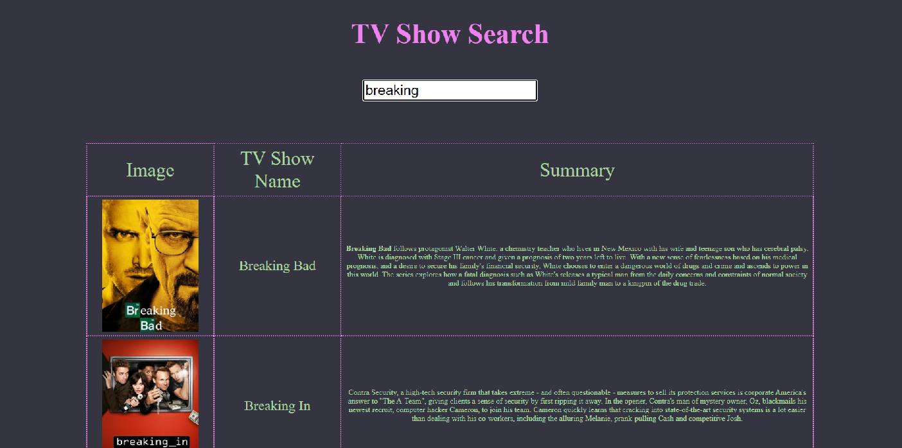

# TV Search

> A project that uses a free api to get information on specified TV shows.

My own version of a project from colt steele`s web developer bootcamp.

## Built With

- HTML
- CSS
- JavaScript
- Axios library
- tvmaze API

## Live Demo

[Try me!](https://johndmurphy.github.io/tv-show-search/)

## Authors

👤 **Author**

- GitHub: [@JohnDMurphy](https://github.com/JohnDMurphy)

## 🤝 Contributing

Contributions, issues, and feature requests are welcome!

Feel free to check the [issues page](https://github.com/JohnDMurphy/tv-show-search/issues).

## Show your support

Give a ⭐️ if you like this project!

## Acknowledgments

- [Colt Steele`s Web Developer Bootcamp](https://www.udemy.com/course/the-web-developer-bootcamp/)
- [tvmaze.com](https://www.tvmaze.com/api)
- [Axios](https://github.com/axios/axios)

## 📝 License

This project is [MIT](./MIT.md) licensed.
